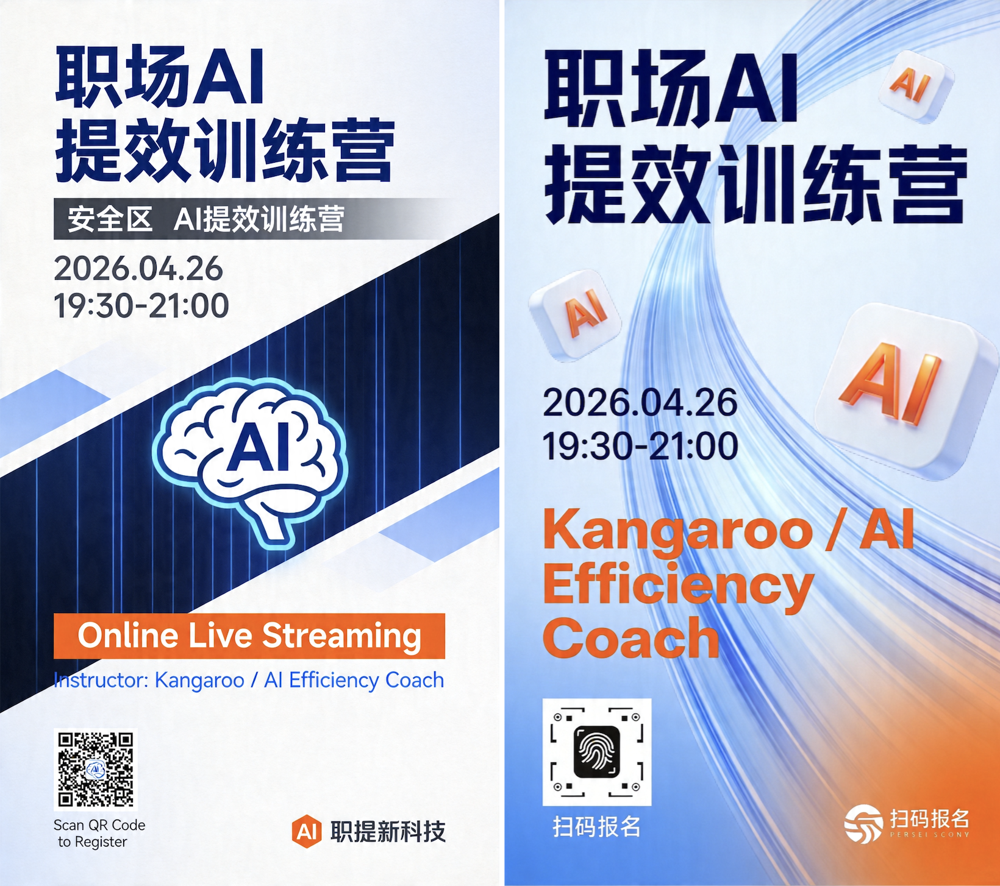
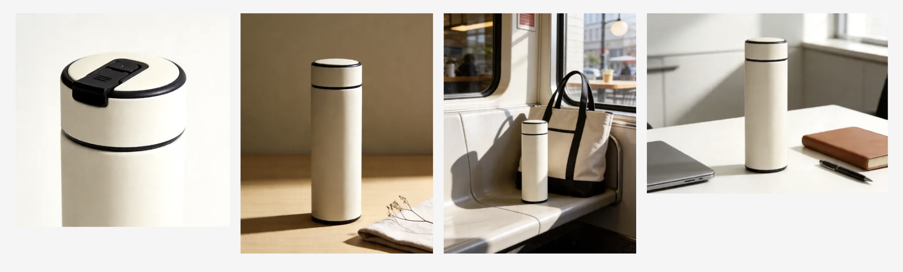
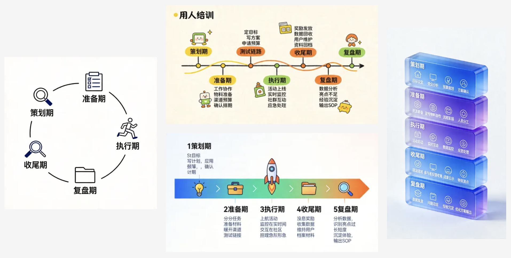
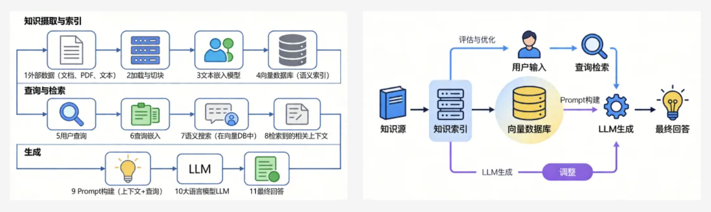

# Design Image Studio

把一个模糊的视觉需求，直接变成可落地生成的高质量设计图。

`design-image-studio` 是一个面向创意与设计场景的 Agent Skill。它不是简单地把一句话塞给文生图模型，而是先读取并保留完整的 Claude 设计系统提示词，再把需求整理成设计推理和结构化 brief，最后把这些设计判断压缩成更强的生图 Prompt，并直接调用 Volcengine Seedream 生成图片。

它适合做的不是泛泛的“AI 生图”，而是更接近设计工作流的任务：海报、商品图、PPT 配图、信息图风格视觉、教学演示图。

## 为什么做这件事

现在很多 AI 生图的问题，不是模型不够强，而是输入太弱。

用户给模型的往往只有一句模糊需求，比如“帮我做一张海报”“来一张高级感商品图”。这种输入对生成模型来说信息远远不够，所以结果就很容易滑向几个常见问题：

- 画面有细节，但没有主次
- 风格很满，但没有设计目的
- 看起来像 AI 图，却不像真正可用的商业视觉
- 可以“好看”，但不适合投放、演示、教学、招商这些真实场景

`design-image-studio` 的目标，就是把“设计判断”补回到生图链路里：先明确用途、受众、构图、气质、留白、安全区和禁忌项，再去调模型。

## 核心设计

这个 skill 现在不是简单的 prompt 模板器，而是一个“设计编译器”：

1. 保留完整的 `Claude-Design-Sys-Prompt` 作为上游设计脑
2. 先生成 `design_reasoning`
3. 再压缩成 `compiled_brief`
4. 最后才生成给图片模型吃的短 Prompt

也就是说，真正做设计判断的是完整的设计系统提示词，而不是几条零散的风格关键词。

## 它解决了什么问题

- 普通生图 Prompt 太泛，结果不稳定
- 海报和 PPT 配图经常没有留白，后续没法放字
- 商品图容易有廉价感，材质、灯光、构图不成立
- 信息图和教学图常常又乱又密，缺乏结构
- 用户想要的是“像设计师一样思考后的图”，不是“模型随便画出来的图”

## 它是怎么工作的

`design-image-studio` 把生图拆成四层：

1. **任务识别层**  
   先判断这是海报、商品图、PPT 配图、信息图还是教学演示图，不同场景使用不同的默认构图和约束。

2. **设计推理层**  
   基于完整的 Claude 设计系统提示词，整理出设计推理：目标、受众、使用场景、视觉系统、主次层级、留白策略、anti-filler 规则和 anti-slop 规则。

3. **编译简报层**  
   把设计推理压缩成结构化 `compiled_brief`，只保留对生图真正有用的部分。

4. **生成执行层**  
   基于 `compiled_brief` 组装最终 Prompt，选择合适的 Volcengine Seedream 模型、分辨率和比例，并直接生成图片。

整个流程由两个脚本组成：

- `scripts/design_image.py`：设计编译层
- `scripts/generate.py`：Volcengine Seedream 生成执行层

## 支持的场景

- 海报生成
- 商品图生成
- PPT 配图生成
- 信息图风格视觉生成
- 教学演示图生成

## Demo

下面这张图是用本仓库生成的示例海报，需求是：

> 为 AI 训练营生成一张高冲击力招生海报，强调速度、增长、实战


## Case Gallery

下面这些案例图都来自同一套 `design-image-studio` 工作流，重点不是“单张图好不好看”，而是这个 skill 能否稳定覆盖不同设计任务。

### 海报方向稿

同一份 brief 先出多个方向，适合做活动海报、课程海报、社群传播图的第一轮探索。



### 商品图素材组

同一商品一次性生成多场景电商图，适合主图、办公场景、通勤场景、细节图和社交媒体展示图。



### PPT 配图方向稿

适合企业内部分享、培训课件和汇报材料。重点不是做海报感，而是帮助观众更快理解观点。


### 信息图结构图

适合流程说明、培训材料和结构化表达。重点是把信息重新组织成更容易被看懂的层级。



### 教学演示图

适合知识讲解、内训和 AI 工作流说明。下面这张图展示的是 `RAG（AI知识库）工作流程` 的教学型表达。



## 最简单的使用方式

直接对你的 Agent 说：

```text
帮我安装这个skill：https://github.com/kangarooking/design-image-studio
```

安装完成后，再直接说你的需求即可，例如：

```text
用 design-image-studio 帮我生成一张 AI 训练营招生海报，强调速度、增长、实战
```

```text
用 design-image-studio 帮我生成一张高端陶瓷咖啡杯商品图，适合电商首图
```

## 使用前提

这个 skill 依赖火山引擎 ARK 的 API Key。

- 你需要先申请并配置 `ARK_API_KEY`
- Key 获取入口见：[火山引擎 ARK API Key 页面](https://console.volcengine.com/ark/region:ark+cn-beijing/apiKey)
- 调用会产生费用，本质上是在调用火山引擎的图像生成模型能力

本仓库当前主要支持并实际调用的是字节的豆包生图模型：

- `doubao-seedream-4-5-251128`
- `doubao-seedream-5-0-260128`
- `doubao-seedream-5-0-lite-260128`

其中常用关系可以简单理解为：

- `Seedream 4.5`：更偏高质量成品
- `Seedream 5.0`：更强的高阶生成版本，可显式指定
- `Seedream 5.0 lite`：默认的高性价比版本

也就是说，这个 skill 虽然对外表现成一个“设计编译 + 生图”工作流，但底层生成模型其实就是豆包生图对应的 Seedream 系列。

## 本地运行（进阶）

### 1. 安装依赖

```bash
pip install "volcengine-python-sdk[ark]"
```

### 2. 设置 API Key

```bash
export ARK_API_KEY="your_volcengine_ark_api_key"
```

如果没有 Key，可以从 [火山引擎 ARK API Key 页面](https://console.volcengine.com/ark/region:ark+cn-beijing/apiKey) 获取。

注意：

- 调用会消耗额度并产生费用
- 不同模型单次生成成本不同
- `Seedream 4.5 / 5.0 / 5.0 lite` 可以通过参数显式指定

### 3. 直接生成一张海报

```bash
python3 scripts/design_image.py \
  --task poster \
  --brief "为 AI 训练营生成一张高冲击力招生海报，强调速度、增长、实战" \
  --direction balanced \
  --aspect 3:4 \
  --quality final \
  --output ai-training-camp-poster.png
```

### 4. 只输出 Prompt，不直接生成

```bash
python3 scripts/design_image.py \
  --task product \
  --brief "高端陶瓷咖啡杯电商首图，温暖晨光，突出釉面质感" \
  --prompt-only
```

脚本会输出三层中间结果：

- `design_reasoning`
- `compiled_brief`
- `prompt`

## 示例命令

### 海报

```bash
python3 scripts/design_image.py \
  --task poster \
  --brief "AI 训练营招生海报，强调速度、增长、实战，面向想要快速上手 AI 的职场人" \
  --aspect 3:4 \
  --quality final \
  --output poster.png
```

### 显式指定模型

```bash
python3 scripts/design_image.py \
  --task poster \
  --brief "职场 AI 提效训练营宣传海报，专业、高级、活力感，面向职场人和管理者" \
  --direction balanced \
  --model-override doubao-seedream-5-0-260128 \
  --aspect 3:4 \
  --output poster-seedream5.png
```

### 商品图

```bash
python3 scripts/design_image.py \
  --task product \
  --brief "高端陶瓷咖啡杯电商首图，温暖晨光，突出釉面质感" \
  --quality final \
  --output cup.png
```

### PPT 配图

```bash
python3 scripts/design_image.py \
  --task ppt \
  --brief "AI 工作流主题演讲封面图，留出标题区，整体偏未来感但不过度花哨" \
  --aspect 16:9 \
  --quality final \
  --output ppt-cover.png
```

### 信息图风格视觉

```bash
python3 scripts/design_image.py \
  --task infographic \
  --brief "展示从数据采集到分析决策的完整流程，要求结构清楚、模块分明、低文本密度" \
  --aspect 4:3 \
  --quality final \
  --output infographic.png
```

### 教学演示图

```bash
python3 scripts/design_image.py \
  --task teaching \
  --brief "解释 RAG 工作流程的教学图，分步骤展示，适合培训课件" \
  --aspect 16:9 \
  --quality final \
  --output teaching-demo.png
```

## 仓库结构

```text
design-image-studio/
├── README.md
├── LICENSE
├── SKILL.md
├── assets/
│   └── demo-poster.png
├── references/
│   ├── claude-design-sys-prompt-full.txt
│   ├── claude-design-map.md
│   ├── design-compiler.md
│   ├── design-principles.md
│   ├── prompt-framework.md
│   ├── model-routing.md
│   ├── poster.md
│   ├── product-image.md
│   ├── ppt-visual.md
│   ├── infographic.md
│   ├── teaching-demo.md
│   ├── anti-slop-and-failure-patterns.md
│   ├── models.md
│   └── troubleshooting.md
└── scripts/
    ├── design_image.py
    └── generate.py
```

## 设计方法来源

这个 skill 的上层设计判断主要来自两部分：

- 完整保留并使用 Claude 设计系统提示词，而不是只保留摘要
- 对 Volcengine Seedream 能力的封装：保留其模型路由、成本控制、图生图、多图融合和错误处理能力

因此它本质上是“完整设计系统 + 生图执行”的组合，而不是单纯的 API 包装器。

## 已知边界

- 信息图和教学图更适合生成“视觉底图”或“结构图感”，不适合直接要求模型输出大量精确小字
- 如果任务目标是可编辑图表、精确排版、像素级 UI，还应该走 HTML / SVG / PPT 这类可编辑产物
- 这套工作流更擅长先出高质量视觉方向，再做后续设计加工

## 关于作者

**袋鼠帝 kangarooking** — AI 博主，独立开发者。AI Top 公众号「袋鼠帝 AI 客栈」主理人

火山引擎领航 KOL，百度千帆开发者大使，GLM 布道师，Trae 昆明第一任 Fellow

| 平台 | 链接 |
|------|------|
| 𝕏 Twitter（袋鼠帝） | https://x.com/aikangarooking |
| 小红书（袋鼠帝） | https://xhslink.com/m/5YejKvIDBbL |
| 抖音（袋鼠帝） | https://v.douyin.com/hYpsjphuuKc |
| 公众号 | 袋鼠帝 AI 客栈 |
| 视频号 | AI 袋鼠帝 |

## License

MIT. See [LICENSE](./LICENSE).
